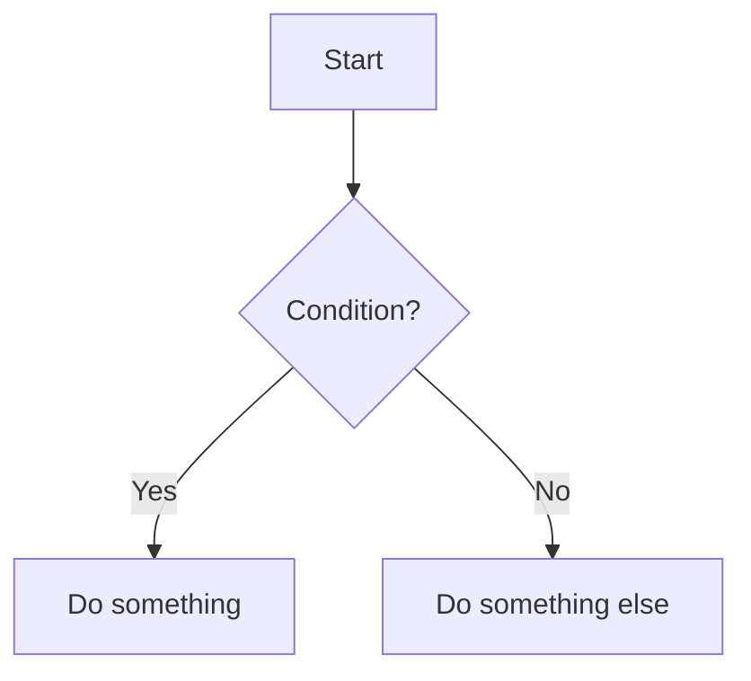

# How to Contribute to ProjectPy

Welcome to **ProjectPy** — a free, open-source Python documentation platform built by the community, for the community. Whether you're fixing a typo, adding a diagram, or writing an entire new guide, your contribution matters.

**Author & Maintainer:** [Souhardya Das](https://github.com/Sdas2003810)

---

## Why Contribute?

- Help millions of Python learners worldwide get better explanations
- Build your open-source portfolio and GitHub activity
- Learn deeply by teaching — writing docs is one of the best ways to master Python
- Get credited in the project

---

## Ways You Can Help

<div class="grid cards" markdown>

-   :material-format-letter-case:{ .lg .middle } __Fix Typos & Grammar__

    ---

    Spotted a spelling mistake or awkward phrasing? Even a one-line fix is a valuable contribution.

-   :material-lightbulb-outline:{ .lg .middle } __Improve Explanations__

    ---

    If something feels confusing, rewrite it with better analogies or simpler language for beginners.

-   :material-code-tags:{ .lg .middle } __Add Code Examples__

    ---

    Contribute real-world, runnable Python 3.12+ code snippets that demonstrate concepts clearly.

-   :material-chart-timeline-variant:{ .lg .middle } __Add Diagrams__

    ---

    Help visual learners by adding Mermaid diagrams for call stacks, memory models, or control flow.

-   :material-book-plus-outline:{ .lg .middle } __Write New Guides__

    ---

    Pick any planned module from our [Coverage Status](../coverage.md) page and write a full guide for it.

-   :material-bug-outline:{ .lg .middle } __Report Issues__

    ---

    Found something outdated, broken, or wrong? Open a GitHub issue — no fix required!

</div>

---

## Local Development Setup

### Prerequisites

- **Python 3.10+** installed on your system
- **Git** installed and configured
- A **GitHub account**

### Step-by-Step Setup

=== "Windows"

    ```powershell
    # 1. Fork the repo on GitHub, then clone your fork
    git clone https://github.com/YOUR_USERNAME/projectpy.git
    cd projectpy

    # 2. Create a virtual environment
    python -m venv .venv
    .venv\Scripts\activate

    # 3. Install dependencies
    pip install -r requirements.txt

    # 4. Start the live-reloading preview server
    mkdocs serve
    ```

=== "macOS / Linux"

    ```bash
    # 1. Fork the repo on GitHub, then clone your fork
    git clone https://github.com/YOUR_USERNAME/projectpy.git
    cd projectpy

    # 2. Create a virtual environment
    python3 -m venv .venv
    source .venv/bin/activate

    # 3. Install dependencies
    pip install -r requirements.txt

    # 4. Start the live-reloading preview server
    mkdocs serve
    ```

Then open **`http://127.0.0.1:8000`** in your browser. Every time you save a `.md` file, the browser automatically refreshes with your changes — no manual reload needed!

---

## Repository Structure

Understanding where everything lives makes contributing much easier:

```
projectpy/
├── docs/                        # All Markdown documentation (edit here!)
│   ├── index.md                 # Home page / landing page
│   ├── coverage.md              # Module coverage status page
│   ├── stylesheets/extra.css    # Custom CSS theme
│   ├── assets/                  # Images, favicon
│   │
│   ├── getting-started/         # Installation, interpreter, first program
│   ├── fundamentals/            # Variables, strings, lists, loops, functions
│   ├── core/                    # Comprehensions, files, exceptions, OOP
│   ├── advanced/                # Decorators, asyncio, typing, metaclasses
│   │
│   ├── standard-library/        # Dedicated stdlib module guides (add new ones here!)
│   │   ├── overview.md          # Overview + links to all guides
│   │   ├── pathlib.md           # Example stdlib guide
│   │   └── ...
│   │
│   ├── language-reference/      # Formal Python language spec
│   ├── setup-usage/             # Platform setup (Windows/Mac/Linux)
│   ├── packaging/               # pip, PyPI, venv, distributing
│   ├── howto/                   # Practical deep-dive HOWTOs
│   ├── faq/                     # Frequently asked questions
│   ├── reference/               # Cheat sheet, operators, exceptions
│   ├── troubleshooting/         # Common error explanations
│   ├── whats-new/               # Python 3.9–3.14 changelogs
│   └── community/               # Contributing, Code of Conduct
│
├── mkdocs.yml                   # Site configuration (nav, plugins, theme)
├── requirements.txt             # Python build dependencies
├── CONTRIBUTING.md              # Quick contribution summary
├── CODE_OF_CONDUCT.md           # Community rules
└── LICENSE                      # MIT License
```

---

## Writing a New Module Guide

The most impactful contribution is a new standard library guide. Here's the recommended structure:

### 1. Pick a Module

Go to the [Coverage Status](../coverage.md) page and pick any module marked as Planned that you're familiar with.

### 2. Create the File

Create `docs/standard-library/your-module.md`. Use this template:

````markdown
# `your_module` — Short Description

!!! abstract "What You'll Learn"
    - What `your_module` is for
    - Key classes and functions
    - Practical real-world examples

---

## Overview

Plain-English explanation of what the module does and when you'd use it.

## Core API

### `module.SomeClass`

Brief description.

```python
import your_module
# example code here
```

<div class="terminal-output-label">:material-console: Output</div>
<div class="terminal-output">expected output here</div>

---

## Real-World Example

A complete, runnable example showing a practical use case.

---

## Common Pitfalls

!!! warning "Watch out for..."
    Describe a common mistake and how to avoid it.

---

## Further Reading

- [Official CPython docs — `your_module`](https://docs.python.org/3/library/your_module.html)
````

### 3. Register in `mkdocs.yml`

Add an entry under the `Standard Library:` section in [`mkdocs.yml`](https://github.com/projectpy70/projectpy/blob/main/mkdocs.yml):

```yaml
- Standard Library:
    - Your Module Name: standard-library/your-module.md
```

### 4. Update `coverage.md`

Update the row in [`docs/coverage.md`](../coverage.md) for your module to `:material-check-circle: Covered` with a link to your new guide.

---

## Style Guidelines

Following these guidelines keeps the documentation consistent and beginner-friendly:

!!! tip "Language"
    Write like you're explaining to a smart friend who just started programming, not to an expert. Avoid jargon unless you explain it.

!!! note "Code Blocks"
    Always specify the language identifier on code blocks. Use `python` for Python, `bash` / `powershell` for shell commands, and `mermaid` for diagrams.

    ```python
    # Good — has language tag and is clean, self-contained
    from datetime import datetime
    now = datetime.now()
    print(now.strftime("%Y-%m-%d"))
    ```

!!! warning "Avoid These"
    - Snippets that import things without explanation
    - Output that doesn't match the code
    - Long blocks of code with no comments
    - Passive voice ("it is used to...") — prefer active ("use this to...")

### Admonitions

Use MkDocs Material admonitions to highlight important content:

```markdown
!!! tip "Pro Tip"
    Use f-strings over `.format()` for readability in Python 3.6+.

!!! warning "Common Mistake"
    Never use mutable defaults in function signatures.

!!! note "Context"
    This behaviour changed in Python 3.11.

!!! abstract "What You'll Learn"
    Use at the top of each major guide.
```

### Diagrams

Use Mermaid for diagrams where it helps understanding:

````markdown

````

---

## Pull Request Checklist

Before opening a PR, run through this checklist:

- [ ] My Markdown renders correctly locally (`mkdocs serve`)
- [ ] All internal links work (no 404s)
- [ ] Code examples are tested and produce correct output
- [ ] I've verified the strict build passes:
    ```bash
    mkdocs build --strict
    ```
- [ ] I've updated `coverage.md` if I added a new stdlib guide
- [ ] I've added my guide to the `nav:` section in `mkdocs.yml`
- [ ] I've followed the style guidelines above

---

## Reporting Issues

Found a bug, outdated content, or missing topic? [Open a GitHub issue](https://github.com/projectpy70/projectpy/issues/new) with:

1. **What page** is affected (include the URL)
2. **What's wrong** — broken link, wrong output, confusing explanation, etc.
3. **What should it say** — if you know the fix, include it!

---

## Code of Conduct

All contributors are expected to follow our [Code of Conduct](code-of-conduct.md). Be kind, welcoming, and constructive. We are an inclusive community — beginners and experts are equally valued here.

---

## Thank You

Every contributor — no matter how small the fix — helps thousands of learners. Thank you for making ProjectPy better for everyone.

> *"In open source, we felt uncomfortable if people watched us write code. Over time, I learned the opposite: transparency builds trust."*
